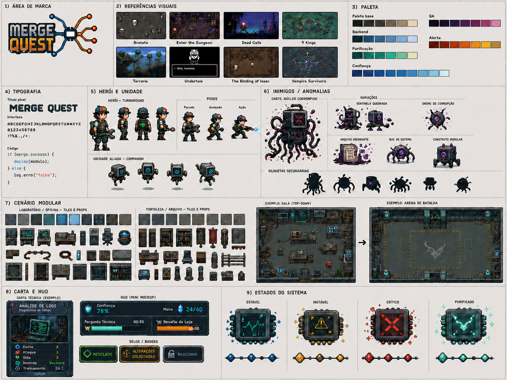
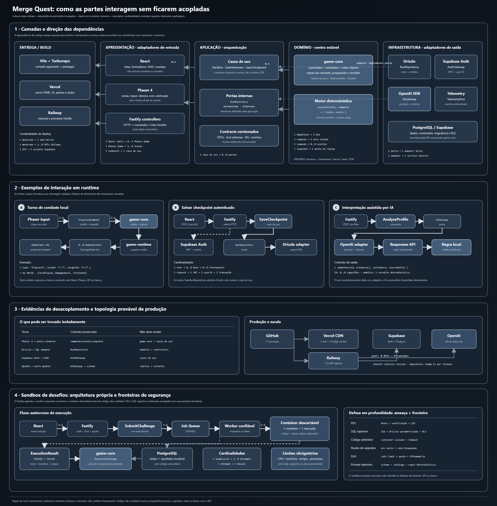

# Merge Quest

Uma experiência web gamificada em pixel art que transforma a preparação para uma vaga de tecnologia em uma jornada de exploração, combate tático e desenvolvimento profissional.

> **O perfil define os recursos do jogador. A vaga define os conflitos da jornada.**



## Visão do produto

O jogador informa seu perfil profissional e uma descrição de vaga. O Merge Quest estrutura essas informações, identifica aderências, lacunas e incertezas, monta um deck inicial baseado nas evidências do perfil e gera uma jornada baseada nos requisitos da vaga.

Durante a run, exploração, batalhas, perguntas e desafios aplicados produzem evidências auditáveis. Ao final, o sistema entrega um relatório com aderências, treinamento, lacunas e próximos passos — sem prometer contratação e sem confundir ausência de evidência com incompetência.

## Jornada

```text
Cadastro e login
  → análise e revisão do perfil
  → análise e revisão da vaga
  → cruzamento perfil × vaga
  → deck inicial e briefing
  → exploração e batalhas
  → perguntas e desafios aplicados
  → chefe
  → veredito e relatório
```

Os vereditos possíveis são:

- `MERGED`: boa aderência e evidências suficientes para avançar;
- `CHANGES REQUESTED`: aderência parcial com lacunas tratáveis;
- `DRAFT`: evidências insuficientes ou distância relevante para os requisitos atuais.

## Princípios inegociáveis

- A ausência de uma competência no perfil significa “não identificada”, não “não sabe”.
- O desempenho no card game não cria experiência profissional por si só.
- A IA interpreta, contextualiza e redige; ela não inventa a verdade técnica.
- Respostas, rubricas, competências e conteúdo ativo vêm de catálogo curado.
- Combate, recompensas e veredito são calculados por regras determinísticas.
- React e Phaser apresentam o estado; `game-core` é a fonte oficial da run.
- O vertical slice completo vem antes da expansão de escopo.

## Vertical slice

O primeiro recorte demonstrável terá duração-alvo de 12–18 minutos:

- um agrupamento de requisitos;
- Backend como domínio dominante e QA como secundário;
- 5–6 salas em uma arquitetura Laboratório/Oficina;
- uma batalha comum com duas perguntas;
- uma loja com um desafio aplicado;
- um chefe em duas fases com quatro perguntas;
- escolha de recompensa;
- relatório resumido usando dados reais da run.

Elites, cinco andares completos, ranking, perfil público e suporte mobile completo permanecem fora do vertical slice.

## Arquitetura

O projeto usa um monorepo pnpm + Turborepo com dependências apontando para as camadas internas.

```text
Merge Quest/
├── apps/
│   ├── web/              # shell React, telas, overlays e montagem do Phaser
│   └── api/              # Fastify, casos de uso e composição de infraestrutura
├── packages/
│   ├── game-core/        # estado e regras determinísticas em TypeScript puro
│   ├── game-runtime/     # adaptação Phaser, cenas, input, áudio e animação
│   ├── contracts/        # schemas, DTOs, eventos e IDs versionados
│   ├── ui/               # Design System e componentes React
│   ├── config/
│   ├── telemetry/
│   └── testing/
├── content/              # catálogos técnicos curados e versionados
├── art/                  # fontes, exports, previews, referências e licenças
├── docs/                 # documentação canônica, ADRs e relatórios
├── tooling/              # validação, geração, Aseprite e automações
├── infrastructure/
└── tests/                # integração, E2E e validação visual
```

Fluxo oficial do estado do jogo:

```text
comando de React ou Phaser
  → game-core calcula
  → novo estado + eventos + snapshot
  → React e Phaser atualizam a apresentação
```

`game-core` não importa React, Phaser, DOM, rede, banco de dados ou SDK de IA.

### Diagrama completo



Para editar ou ampliar sem perder qualidade, use a
[versão vetorial em SVG](docs/architecture/merge-quest-system-architecture.svg).

## Stack

| Área | Tecnologia |
|---|---|
| Monorepo | pnpm Workspaces + Turborepo |
| Web | React + Vite + TypeScript |
| Jogo | Phaser 4.2 |
| Core | TypeScript puro e determinístico |
| API | Node.js + Fastify + Zod |
| Persistência | PostgreSQL/Supabase + Drizzle ORM |
| Autenticação | Supabase Auth |
| IA | SDK oficial da OpenAI + Responses API |
| Testes | Vitest + Playwright |
| Arte | Aseprite + Lua + Phaser |

Fastify, Drizzle, Supabase e OpenAI permanecem atrás de portas e adapters. O sandbox de desafios será um worker ou serviço isolado, nunca o processo HTTP.

## Direção visual

- pixel art intermediária em resolução lógica `480×270`, ampliada em escala inteira para `960×540`;
- 75% ambiente técnico e 25% fantasia;
- oficinas, laboratórios, arquivos e infraestrutura fantástica;
- personagens em canvas técnico `48×48`;
- sem antialiasing;
- UI modular, precisa e legível;
- assets aprovados nunca são sobrescritos silenciosamente.

## Equipe e ownership

| Pessoa | Lidera |
|---|---|
| Eduardo | Phaser, game runtime, sprites, animações, integração visual, E2E e entrega |
| Hahn | API, PostgreSQL/Supabase, auth, schemas, migrações, catálogo, checkpoints e sandbox |
| Guilherme | React, Design System, UX de IA, prompts, schemas de saída e relatórios |

Testes, integração, documentação, revisão técnica e playtests são responsabilidades compartilhadas. Nenhuma pessoa é a única testadora do projeto.

## Preparando o ambiente

Pré-requisitos:

- Node.js `24.15.0` recomendado, ou `24.14.0+` dentro da linha 24;
- pnpm `11.9.0`;
- Git.

```powershell
git clone https://github.com/juninhos-comunidade/code-apes.git
cd "Merge Quest"
pnpm install --frozen-lockfile
pnpm verify
```

O pipeline padrão não exige credenciais do Supabase ou da OpenAI.

Para iniciar a API:

```powershell
Copy-Item apps/api/.env.example apps/api/.env
pnpm --filter @merge-quest/api dev
```

O endpoint `GET /health` funciona sem banco ou serviços externos.

## Qualidade e reprodutibilidade

```powershell
pnpm check:reproducibility
pnpm typecheck
pnpm test
pnpm lint
pnpm build
```

Ou execute tudo:

```powershell
pnpm verify
```

Uma instalação limpa com lockfile congelado foi auditada com sucesso. Consulte [`docs/reproducibility-audit-report.md`](docs/reproducibility-audit-report.md) para resultados e limitações.

## Documentação

- [`PROJECT-MAP.md`](PROJECT-MAP.md): visão resumida e canônica;
- [`AGENTS.md`](AGENTS.md): regras duráveis para agentes e contribuições;
- [`CONTRIBUTING.md`](CONTRIBUTING.md): setup, ownership e fluxo de colaboração;
- [`REQUIREMENTS.md`](REQUIREMENTS.md): pré-requisitos e instalação;
- [`docs/product/`](docs/product/): visão, requisitos, game design e vertical slice;
- [`docs/design/`](docs/design/): Design Book e pipeline de arte;
- [`docs/engineering/`](docs/engineering/): arquitetura em camadas, contratos e desenvolvimento local;
- [`docs/architecture/`](docs/architecture/): monorepo, decisões e ADRs;
- [`docs/linear/12-linear-bootstrap.md`](docs/linear/12-linear-bootstrap.md): proposta de organização do backlog.

## Status

O repositório está na fase de fundação técnica:

- scaffolding do monorepo concluído;
- documentação canônica organizada;
- API TypeScript estruturada e validada;
- instalação reproduzível comprovada;
- funcionalidades, conteúdo ativo e sprites do vertical slice ainda não foram implementados.

O próximo passo de produto é aprovar os contratos iniciais e o primeiro schema PostgreSQL com políticas RLS antes da implementação do vertical slice.
