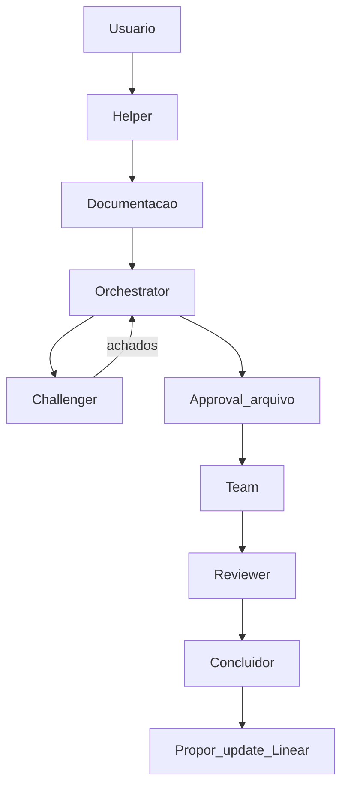

# Workflow multi-agente — Merge Quest

> Complementa [`agent.md`](../../agent.md). Hierarquia: `AGENTS.md` → `agent.md` → este arquivo.  
> Normativo: [`agent-workflow-committee.spec.md`](../specs/agent-workflow-committee.spec.md).

## Regra zero

1. **Helper** em toda solicitação que vire trabalho (exceto meta-pergunta pura).
2. **Nenhuma fatia chega ao Team** sem plano + Approval (trilha Light ainda exige Approval leve).
3. **`[FATO]` vs `[DECISÃO]`** no brief — fato confirma-se em código/spec; decisão volta ao humano.
4. **Contexto em arquivo** — `sessions/<id>/`.
5. **Quem implementa ≠ quem revisa ≠ quem fecha.**
6. **Chat ≠ Approval.**
7. **Sem micro-aprovações** após Approval do plano — só interromper para ação sensível.

## Fases

```
helper → decomposition → planning → challenge → approval → team → review → conclusion
```

| Fase | Ator | Artefato |
|------|------|----------|
| helper | Helper | `brief.md` |
| decomposition | Documentação | spec/ADR + proposal Linear |
| planning | Orchestrator | `plan.md` + tags `[mq:…]` |
| challenge | Challenger | `challenge.md` |
| approval | Humano | `approvals/*.md` |
| team | Team domínio | código/assets + testes |
| review | Reviewer | `reviews/spec.md`, `reviews/code.md` |
| conclusion | Concluidor | `conclusion.md` + propostas Linear/PR |

Atualizar `phase.md` a cada avanço. Ver trilhas em [`tracks.md`](tracks.md).

## Fluxo Full



## Autonomia pós-Approval

Permitido sem nova pergunta: editar arquivos do plano, rodar testes/lint/typecheck, corrigir falhas locais, ajustar implementação aos critérios.

Voltar ao humano quando a próxima ação for: commit/amend, push, PR, merge, deploy, deletar amplo, config global, segredo, **mutar Linear**, mutar banco compartilhado, ampliar escopo, waiver de gate, serviço pago.

## Papéis (resumo)

| Papel | Faz | Não faz |
|-------|-----|---------|
| Helper | Lentes MQ, trilha, brief | Código, Approval |
| Documentação | Specs; propor Linear | Criar issue sem Approval; implementar |
| Orchestrator | Plano fatiado | Implementar; “aprovar” no chat |
| Challenger | Quebrar plano | Reescrever produto; implementar |
| Team | TDD + entrega na área | Review final; fechar processo |
| Reviewer | Dois eixos | Implementar o fix (pode pedir) |
| Concluidor | Fechar sessão / prep PR | Expandir feature |

Harnesses: [`harness/`](harness/).

## Definition of Done (fatia)

- Critérios da issue Linear / spec cumpridos
- Teste relevante (TDD em regras)
- Typecheck + lint no escopo
- Reviewer sem bloqueio aberto
- Docs atualizados se aplicável
- Sem expansão silenciosa de escopo

## Relação com Linear

Ver [`decomposition-linear.md`](decomposition-linear.md). Sessão sempre lista `linearIssues: [MER-…]` em `phase.md`.
